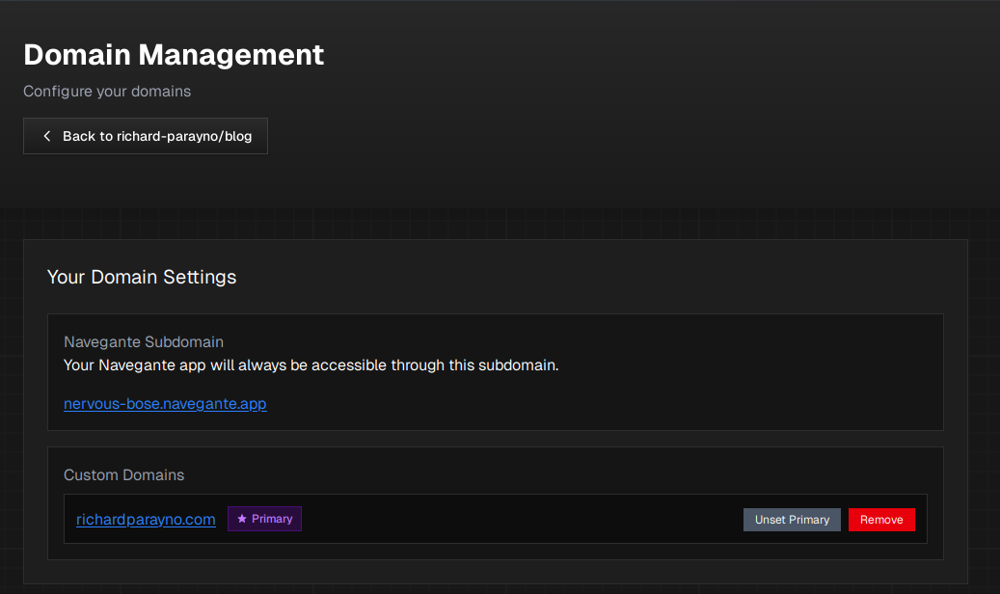
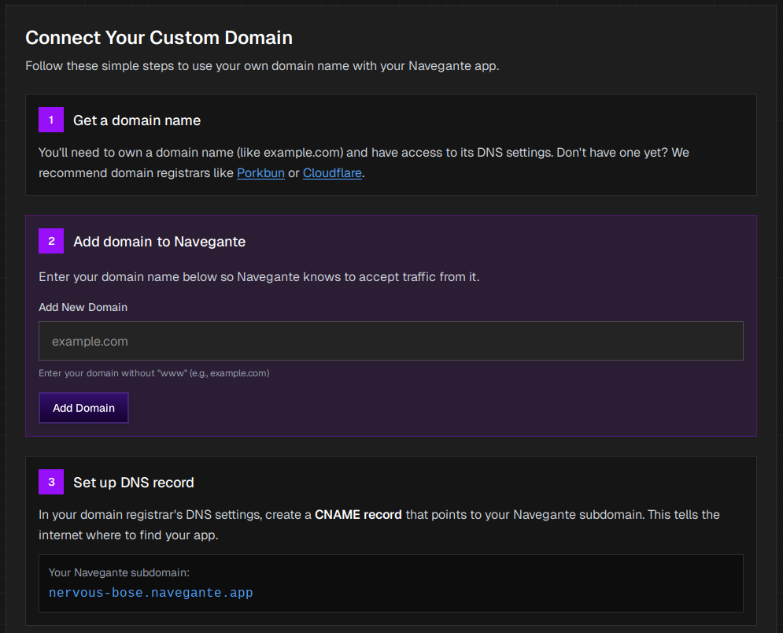

import { Steps } from "@astrojs/starlight/components";

## Overview

Every app deployed on Navegante receives a free **fallback domain** in the format `*.navegante.app`. This applies to all apps on both free and paid plans. Your app will always be accessible through this subdomain.

You can also connect your own custom domains to your Navegante apps at no additional charge. Custom domains are configured by creating a CNAME record that points to your fallback domain.

## Fallback Domains

When you deploy an app on Navegante, it is automatically assigned a unique subdomain such as `nervous-bose.navegante.app`. This is your fallback domain.

Your fallback domain:

- Is always available, even if you add custom domains
- Requires no configuration
- Is included free with every app

## Custom Domains

Custom domains allow you to use your own domain name (e.g., `example.com`) with your Navegante app. There is no additional charge for custom domains.

:::note
Navegante currently supports one custom domain per app. This domain is automatically set as your primary domain.
:::

### Adding a Custom Domain

To connect a custom domain to your Navegante app:

<Steps>

1.  ### Get a domain name

    You'll need to own a domain name and have access to its DNS settings. If you don't have one yet, we recommend domain registrars like [Porkbun](https://porkbun.com) or [Cloudflare](https://cloudflare.com).

2.  ### Add domain to Navegante
    1. Navigate to your [App Configuration](../reference/application-configurations)
    2. Click **"Manage Domains"** in the Domains section
    3. Enter your domain name without "www" (e.g., `example.com`)
    4. Click **"Add Domain"**

3.  ### Set up DNS record

    In your domain registrar's DNS settings, create a **CNAME record** that points to your Navegante subdomain. This tells the internet where to find your app.

    | Record Type | Name         | Value                          |
    | ----------- | ------------ | ------------------------------ |
    | CNAME       | `@` or `www` | `your-subdomain.navegante.app` |

    For example, if your Navegante subdomain is `nervous-bose.navegante.app`, your CNAME record should point to that address.

    :::note
    DNS changes can take up to 24-48 hours to propagate, though they often take effect within a few minutes.
    :::

</Steps>

## Managing Your Custom Domain

Once you've added a custom domain, you can manage it from the Domain Management page.

Your custom domain is automatically set as the **Primary** domain, which is the main entry point for your application. Your fallback domain remains accessible as a backup and cannot be disabled.

### Removing a Domain

To remove your custom domain, click the **"Remove"** button next to the domain you want to delete.

## Related Pages

- [Application Configurations](../reference/application-configurations) - Access domain settings from your app's control plane
- [Quick Start](../quick-start) - Deploy your first app and get a free fallback domain
