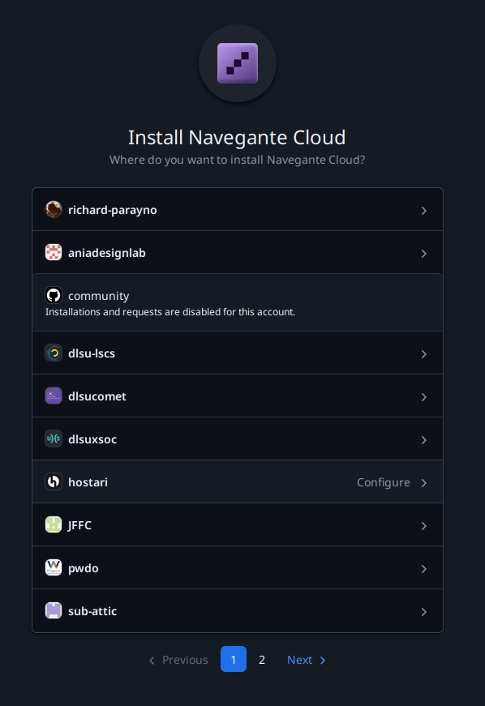

## What is the Navegante Github App?

The Navegante Github App is how Navegante securely connects to your Github repositories to pull, build, and deploy your software. The app requests **read-only access** to only the repositories you explicitly grant access to. This includes personal, public, private, and organization repos.

Navegante never has access to repositories you haven't explicitly authorized.

## Installing the Github App

After creating your Navegante account, you will be prompted to install the Navegante Cloud Github App. During installation:

1. Choose whether to install the app for your personal account or an organization
2. Select which repositories the app can access:
   - **All repositories** — Grants access to all current and future repositories
   - **Only select repositories** — Grants access only to the repositories you explicitly choose
3. Confirm the installation

The app only requests read-only permissions necessary to pull your code for deployment.

## What Permissions Does the App Request?

The Navegante Github App requests the following permissions:

| Permission | Access Level | Purpose |
|------------|--------------|---------|
| **Repository contents** | Read-only | Pull your code to build and deploy |
| **Metadata** | Read-only | Access basic repository information |

Navegante does not request write access to your repositories.

## Troubleshooting

### Changing Github App Permissions

If you need to add or remove repository access for the Navegante Github App:

1. Go to [Github.com](https://github.com) and sign in
2. Click your profile picture in the top-right corner
3. Select **Settings**
4. In the left sidebar, click **Applications** (under "Integrations")
5. Find **Navegante Cloud** under "Installed GitHub Apps"
6. Click **Configure**
7. Under "Repository access", modify which repositories the app can access:
   - Select **All repositories** or **Only select repositories**
   - Add or remove specific repositories as needed
8. Click **Save**

### App Not Showing Repositories

If your repositories aren't appearing in Navegante after installation:

1. Verify the Github App has access to the repository (see steps above)
2. Ensure you're logged into Navegante with the correct Github account
3. Try refreshing the Navegante dashboard
4. If the issue persists, try uninstalling and reinstalling the Github App

### Organization Repositories

To access organization repositories, the Github App must be installed on the organization (not just your personal account). You may need organization admin permissions to install the app.

## Related Pages

- [Quick Start](../quick-start) - Get started deploying your first project
- [Infrastructure Projects](../reference/infrastructure-projects) - Create projects from your Github repos
