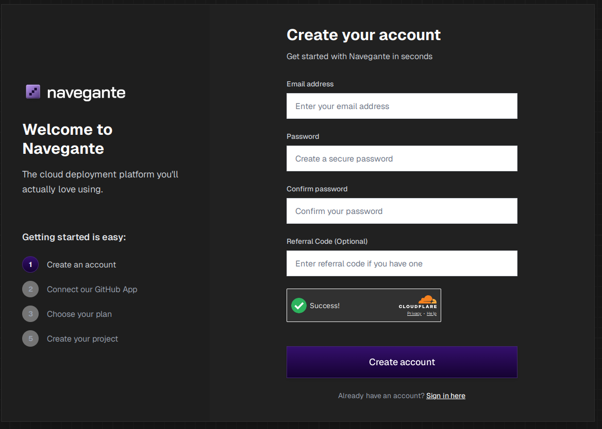
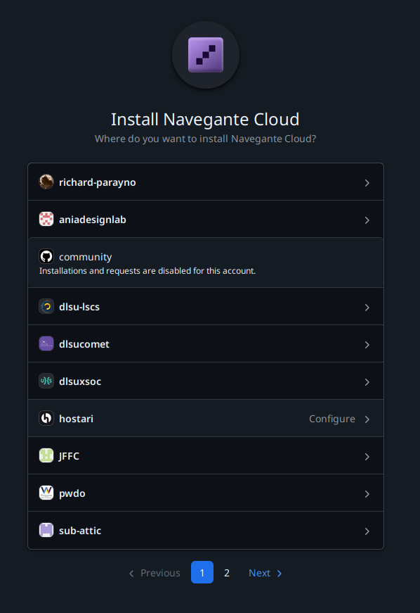
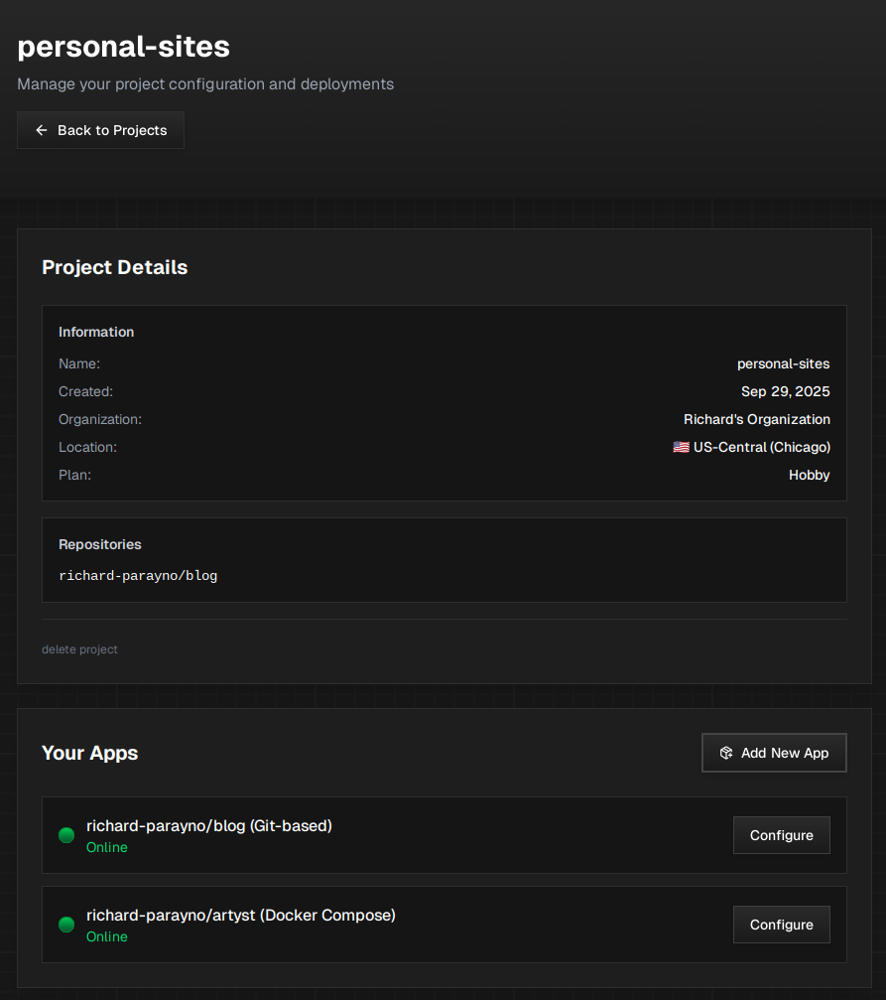
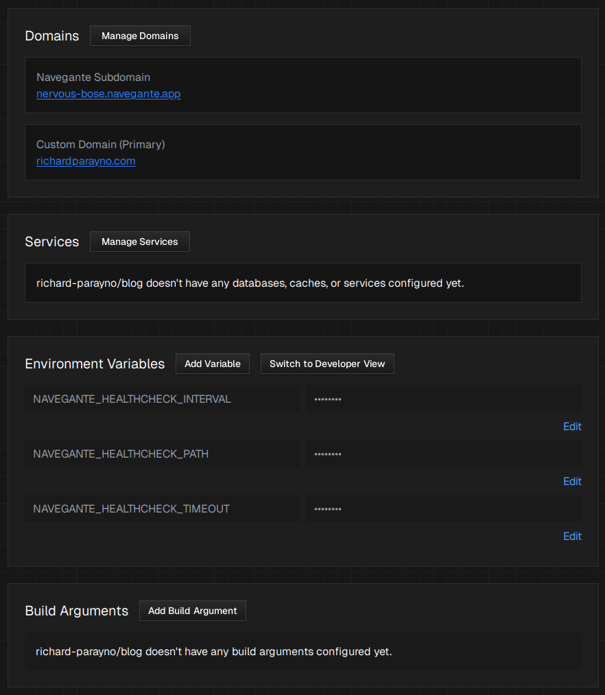
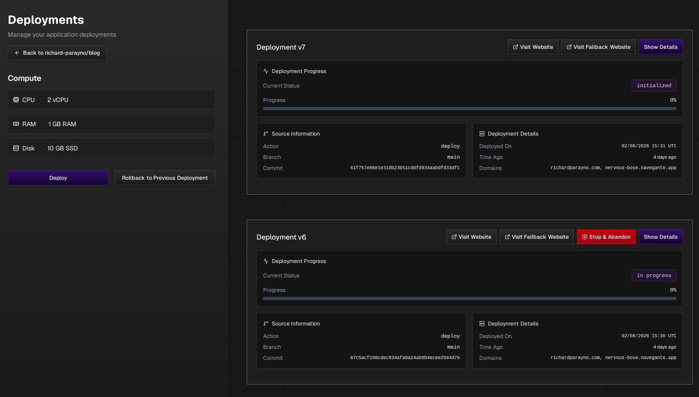
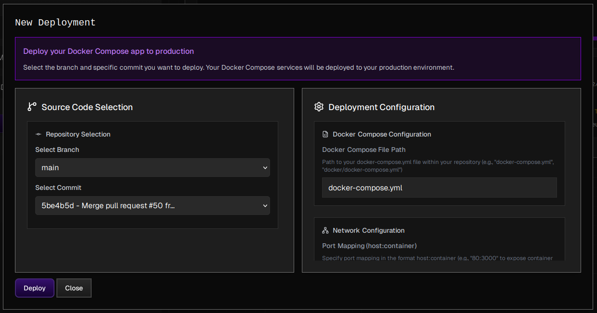

import { Aside } from "@astrojs/starlight/components";
import { CardGrid } from "@astrojs/starlight/components";
import { LinkCard } from "@astrojs/starlight/components";
import { Icon } from "@astrojs/starlight/components";
import { Steps } from "@astrojs/starlight/components";

Go from `localhost` to `production` in as little as 15 minutes by following our quick start guide below.

[ Add Image or Screen Recording here ]

## Deploying your first project on Navegante

<Steps>

1.  ### Prerequisites

    Before you create your Navegante account, you need to have:

        1. An active Github Account\*
        2. Public or private repositories with the code that you want to deploy
        3. Optional: A Docker Compose\*\* file

    _\*We only support Github for now._

    _\*\*We also support projects with `docker-compose.yml` files. Click [here](features/deploy-with-docker-compose) to learn more._

2.  ### Create your free Navegante Account

    <Aside type="tip">
      All Navegante accounts are entitled to 1 free Infrastructure Project
      (Hobby Plan). Read about our [Compute Plans](reference/compute-plans) to
      learn more.
    </Aside>

    Creating a Navegante account is quick, easy, and doesn't require adding a valid payment method. All you need is an active email address\*.

    

    Click [here](https://navegante.app/account_registrations/onboarding?utm_source=nvg_docsite) to create your account.

3.  ### Install the Navegante Cloud Github App

    Navegante relies on Github to securely pull, build, and deploy your software to the Internet.

    After creating your account, you will be prompted to install the Navegante Cloud Github App and provide **read-only access** to your desired personal or organization repos.

    

    Read the [Github Integration](github-app/github-integration) page to learn more about how we securely handle your Github repos.

4.  ### Create your first Infrastructure Project

    [Infrastructure Projects](reference/infrastructure-projects-reference) are collections made up of Github repos that you want to deploy.

    

    To create an Infrastructure Project:

        1. Click on the "Create a New Infrastructure Project" button.
        2. Write the desired name of your Infrastructure Project (or leave it blank for an auto-generated name).
        3. Select the desired [Compute Plan](reference/compute-plans) for your Infrastructure Project.
        4. Select the repos you want to add to your Infrastructure Project.
        5. Create and view your project in the dashboard.

    After successfully creating your Infrastructure Project, you should now be able to configure your through Navegante.

5.  ### Configure your App

    [App Configurations](reference/app-configurations) are the individual Github repos that you added to your Infrastructure Project.

    

    To configure your App:

        1. Click on the "Configure" button to access your [App Configuration](reference/application-configurations)'s dedicated control plane.
        2. All Navegante apps come with a free `*.navegante.app` subdomain. You can add your own custom domain name through the [Domains](features/domains) page.
        2. If your app requires environment variables, you may add them in the "Environment Variables" section at the bottom of the page.
        3. If your app requires additional services (such as databases, caches, CDNs, etc), you may choose to:
            - Add their connection strings in "Environment Variables" (if they are hosted by another provider)
            - or deploy an instance of your services through Navegante's [Managed Services](reference/application-services) found above the "Environment Variables" section.
        4. If your app requires specific build arguments as part of its deployment configuration, you may add those under the [Build Arguments]() section at the bottom of the page.

    After adding any necessary environment variables and services, you should be good to go and ready to deploy!

6.  ### Deploy your App

    [App Deployments](reference/application-deployments) are where you deploy and rollback
    your [App Configurations](reference/application-configurations).

    
    

    To deploy your App:

        1. Inside your App Configuration's dedicated control plane, click on the "Deploy App" button under the Quick Actions section found at the top-half of the page.
        2. Inside the Deployments screen of your App Configuration, select the "Deploy" option.
        3. After clicking "Deploy", a modal will appear where you can select the specific branch and commit you want to deploy. On the right-hand side of the modal, you can also tweak certain deployment settings if you need them. By default, you will not have to change anything here aside from the branch and commit.
        4. Once you are done with setting the parameters for your deployment, click on "Deploy" to initiate the deployment process for your project.

    After triggering the deployment process for your project, you will be redirected to the Deployment Details page which shows the logs from your deployment. If it's successful, you should be able to see your app in production by clicking the "Visit Fallback Website" button. Subsequent commits to your repo will trigger an auto-deploy using the deployment settings you defined earlier.

    Enjoy!

</Steps>

## Check out our deployment guides!

Now that you've deployed your first project on Navegante, you might want to read up on some of our deployment guides\* to reduce potential headaches while deploying on Navegante.

<CardGrid>
  <LinkCard
    title="Deploy Ruby on Rails on Navegante"
    href="/framework-guides/ruby-on-rails"
    description="Everything you need to know about deploying your Ruby on Rails app on Navegante."
  />
  <LinkCard
    title="Deploy Astro on Navegante"
    href="/framework-guides/astro"
    description="Everything you need to know about deploying your Astro app on Navegante."
  />
</CardGrid>

_\*Our deployment guides are based on actual production-grade deployments tested internally by the Navegante team._

## Footnotes

- While we support most web frameworks, there may be instances where some frameworks need additional configuration on the Navegante web app.
- For JS-based frameworks and static site generators, we recommend going through the [JS Deployment Quirks](deployment-quirks/javascript-based-frameworks) and [Static Site Generators Quirks](deployment-quirks/static-site-generators-quirks) section before deploying on Navegante to ensure a smooth experience.
