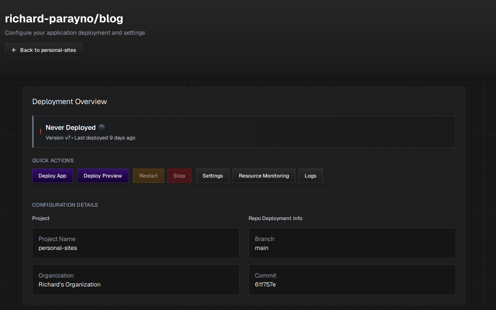
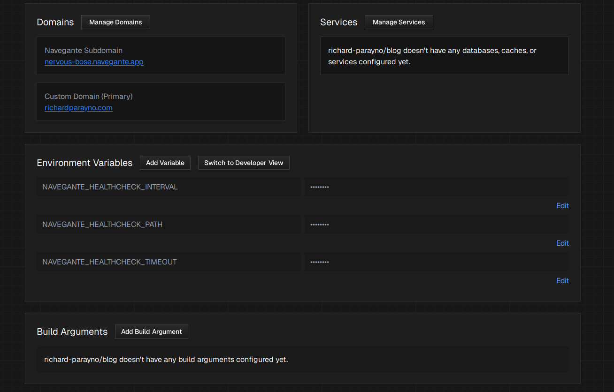

## What are Application Configurations?

Application Configurations are the individual Github repos that you added to your [Infrastructure Project](../infrastructure-projects). Each app has its own dedicated control plane where you can manage deployments, domains, environment variables, services, and more.

To access an App Configuration, click the **"Configure"** button next to any app in your Infrastructure Project's "Your Apps" section.

## Deployment Overview

The Deployment Overview section displays the current status of your application:

- **Deployment Status**: Shows whether your app has been deployed (e.g., "Never Deployed" or the current deployment state)
- **Version**: The current version of your deployed application (e.g., `v7`)
- **Last Deployed**: How long ago the most recent deployment occurred (e.g., "9 days ago")

## Quick Actions

The Quick Actions section provides convenient buttons for common operations:

| Action                  | Description                                                                                                                                 |
| ----------------------- | ------------------------------------------------------------------------------------------------------------------------------------------- |
| **Deploy App**          | Manage the [production deployments](../application-deployments/#production-deployments) of your application.                                |
| **Deploy Preview**      | Manage the automated [preview deployments](../application-deployments/#preview-deployments) for testing changes before going to production. |
| **Restart**             | Reboots your currently running application without redeploying.                                                                             |
| **Stop**                | Stops and shuts down your running application.                                                                                              |
| **Settings**            | Access additional application settings.                                                                                                     |
| **Resource Monitoring** | View resource usage metrics for your application.                                                                                           |
| **Logs**                | Access real-time and historical logs for your application.                                                                                  |

## Configuration Details

This section displays key information about your app's configuration, split into two columns:

### Project

| Field            | Description                                                                          |
| ---------------- | ------------------------------------------------------------------------------------ |
| **Project Name** | The name of the Infrastructure Project this app belongs to (e.g., `personal-sites`). |
| **Organization** | The organization that owns this project (e.g., `Richard's Organization`).            |

### Repo Deployment Info

| Field      | Description                                                          |
| ---------- | -------------------------------------------------------------------- |
| **Branch** | The Git branch currently configured for deployment (e.g., `main`).   |
| **Commit** | The commit hash of the currently deployed version (e.g., `61f757e`). |

---

## Domains

The Domains section manages all URLs where your application can be accessed:

- **Navegante Subdomain**: Every app automatically receives a free `*.navegante.app` subdomain (e.g., `nervous-bose.navegante.app`). This is your fallback URL.
- **Custom Domain (Primary)**: Your own domain name pointed to your Navegante app (e.g., `richardparayno.com`). Custom domains marked as "Primary" are the main entry point for your application.

Click **"Manage Domains"** to add, remove, or configure custom domains for your application. See the [Domains](../../features/domains) documentation for more details.

## Services

The Services section allows you to add managed services to your application, such as:

- Databases (PostgreSQL, MySQL, etc.)
- Caches (Redis, Memcached, etc.)
- Other supporting services

If no services are configured, you'll see a message indicating that the app "doesn't have any databases, caches, or services configured yet."

Click **"Manage Services"** to add or configure services. See the [Managed Services](../application-services) documentation for available options.

## Environment Variables

Environment Variables allow you to configure runtime settings for your application without hardcoding them in your codebase. This section displays all configured variables with their values masked for security.

### Managing Environment Variables

- **Add Variable**: Click to add a new environment variable
- **Switch to Developer View**: Toggle to a developer-friendly view for bulk editing
- **Edit**: Click the "Edit" link next to any variable to modify its value

### Default Environment Variables

Every app configuration on Navegante comes with pre-loaded environment variables that help us deploy your software to the internet:

| Variable                         | Description                                       |
| -------------------------------- | ------------------------------------------------- |
| `NAVEGANTE_HEALTHCHECK_INTERVAL` | How often Navegante checks if your app is healthy |
| `NAVEGANTE_HEALTHCHECK_PATH`     | The URL path used for health check requests       |
| `NAVEGANTE_HEALTHCHECK_TIMEOUT`  | How long to wait for a health check response      |

These environment variables cannot be independently updated by the user.

:::tip
Store sensitive information like API keys, database credentials, and secrets as environment variables instead of raw strings in your codebase.
:::

## Build Arguments

Build Arguments allow you to pass configuration values during the Docker build process. These are different from environment variables as they are only available at build time, not runtime.

Click **"Add Build Argument"** to add build-time configuration values. If no build arguments are configured, you'll see a message indicating that the app "doesn't have any build arguments configured yet."

## Related Pages

- [Infrastructure Projects](../infrastructure-projects) - Learn about the parent container for your apps
- [Application Deployments](../application-deployments) - Deploy and manage your application versions
- [Managed Services](../application-services) - Add databases, caches, and other services
- [Domains](../../features/domains) - Configure custom domains for your app
- [Compute Plans](../compute-plans) - Understand resource allocation for your apps
