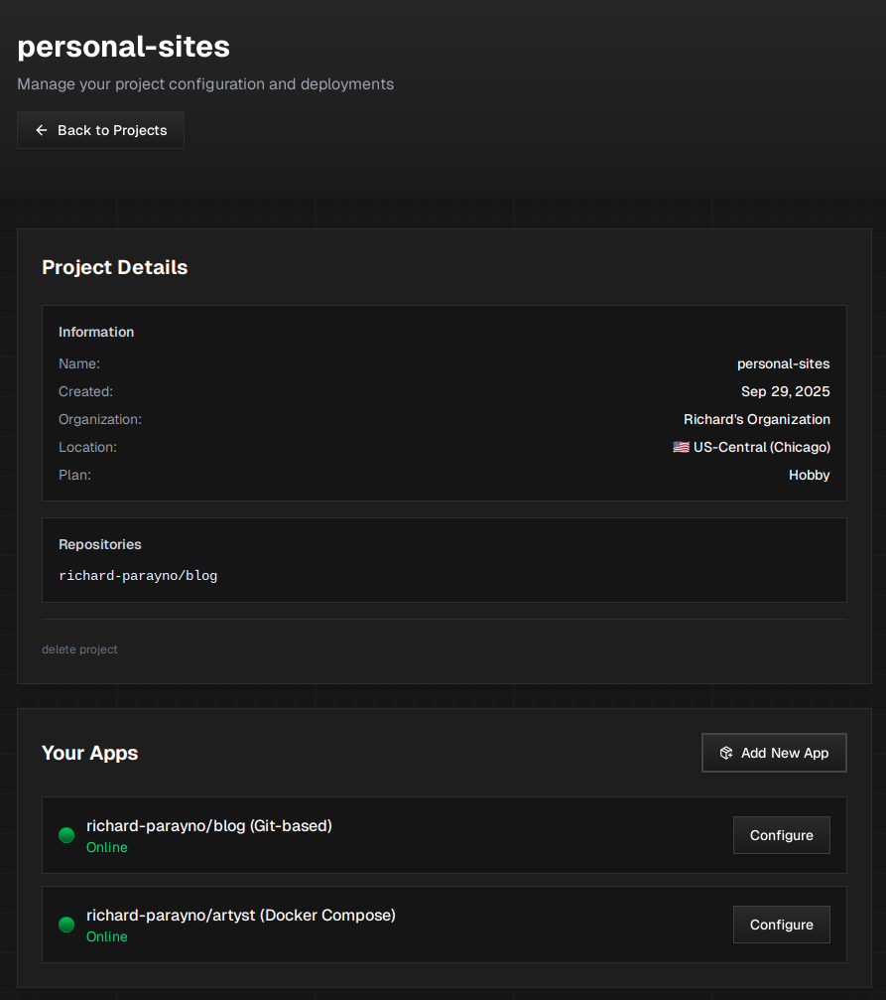

## What are Infrastructure Projects?

Infrastructure Projects are collections made up of Github repos that you want to deploy. They serve as the top-level organizational unit in Navegante, allowing you to group related applications together under a single project with shared configuration settings.

## Project Details

The Project Details section displays high-level information about your Infrastructure Project:

| Field | Description |
|-------|-------------|
| **Name** | The name of your Infrastructure Project (e.g., `personal-sites`). This can be custom or auto-generated. |
| **Created** | The date when the Infrastructure Project was created. |
| **Organization** | The organization that owns this Infrastructure Project. |
| **Location** | The region where your apps will be hosted (e.g., US-Central Chicago). |
| **Plan** | The [Compute Plan](../compute-plans) assigned to this Infrastructure Project (e.g., Hobby, Pro). |

### Repositories

Below the Information section, you'll find a list of all Github repositories that are part of this Infrastructure Project. These are the repos you selected when creating the project or added later.

## Your Apps

The "Your Apps" section displays all the applications within your Infrastructure Project. Each app entry shows:

- **App Name**: The repository name associated with the app (e.g., `richard-parayno/blog`)
- **Deployment Type**: Indicates how the app is deployed:
  - **Git-based**: Standard deployment from a Git repository
  - **Docker Compose**: Deployment using a `docker-compose.yml` file
- **Status Indicator**: A colored dot showing the current status of your app:
  - 🟢 **Online**: The app is running and accessible
  - Other statuses may indicate deploying, offline, or error states
- **Configure Button**: Click to access the [App Configuration](../app-configurations) control plane for that specific app

### Adding New Apps

To add additional apps to your Infrastructure Project:

1. Click the **"Add New App"** button in the Your Apps section
2. Select the Github repository you want to add
3. Configure the app settings as needed

## Managing Your Infrastructure Project

### Deleting a Project

At the bottom of the Project Details section, you'll find the **"delete project"** option. Use this with caution as it will remove the Infrastructure Project and all associated app configurations.

:::caution
Deleting an Infrastructure Project is a destructive action. Make sure to back up any important configuration settings before proceeding.
:::

## Related Pages

- [Compute Plans](../compute-plans) - Learn about the different compute plans available
- [App Configurations](../app-configurations) - Configure individual apps within your project
- [Quick Start](../../quick-start) - Get started with deploying your first project
