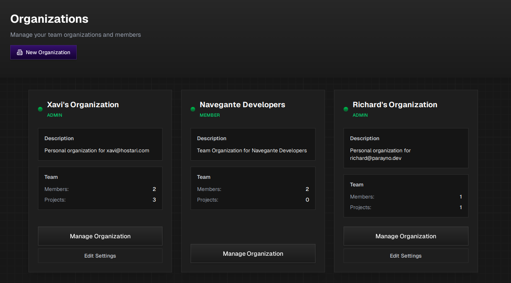
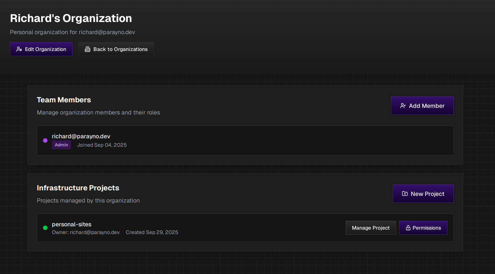

## What are Organizations?

Organizations are the top-level containers in Navegante that allow you to manage your team, members, and [Infrastructure Projects](../infrastructure-projects) in one place. Every Navegante user has at least one personal organization, and can create or join additional organizations for team collaboration.

## Organizations Overview

The Organizations page displays all organizations you have access to. Each organization card shows:

| Field | Description |
|-------|-------------|
| **Name** | The name of the organization (e.g., `Richard's Organization`). |
| **Role** | Your role within the organization: **ADMIN** or **MEMBER**. |
| **Description** | A brief description of the organization's purpose. |
| **Members** | The number of team members in the organization. |
| **Projects** | The number of Infrastructure Projects managed by this organization. |

### Organization Types

- **Personal Organization**: Automatically created for each user (e.g., "Personal organization for richard@parayno.dev"). Ideal for individual projects.
- **Team Organization**: Created for collaborative work with multiple team members (e.g., "Team Organization for Navegante Developers").

### Managing Organizations

Each organization card provides action buttons based on your role:

| Action | Availability | Description |
|--------|--------------|-------------|
| **Manage Organization** | All members | View and manage organization details, members, and projects. |
| **Edit Settings** | Admins only | Modify organization name, description, and other settings. |

### Creating a New Organization

Click the **"New Organization"** button at the top of the page to create a new organization for your team.

---

## Organization Management

When you click **"Manage Organization"**, you'll access the organization's management page with the following sections:

### Header Actions

- **Edit Organization**: Modify the organization's name and description (Admin only).
- **Back to Organizations**: Return to the organizations overview page.

## Team Members

The Team Members section allows you to manage organization members and their roles.

Each member entry displays:

- **Email**: The member's email address
- **Role Badge**: Either **Admin** or **Member**
- **Join Date**: When the member joined the organization

### Member Roles

| Role | Permissions |
|------|-------------|
| **Admin** | Full access to manage organization settings, members, and all projects. Can add/remove members and change roles. |
| **Member** | Can view and access projects they have permissions for. Cannot modify organization settings or manage members. |

### Adding Team Members

Click the **"Add Member"** button to invite new members to your organization. You'll need their email address to send an invitation.

## Infrastructure Projects

The Infrastructure Projects section displays all projects managed by this organization.

Each project entry shows:

| Field | Description |
|-------|-------------|
| **Project Name** | The name of the Infrastructure Project (e.g., `personal-sites`). |
| **Owner** | The email of the project owner. |
| **Created** | The date the project was created. |
| **Status Indicator** | A green dot indicates the project is active. |

### Project Actions

| Action | Description |
|--------|-------------|
| **Manage Project** | Navigate to the project's dashboard to configure apps and deployments. |
| **Permissions** | Manage which organization members have access to this project. |

### Creating a New Project

Click the **"New Project"** button to create a new [Infrastructure Project](../infrastructure-projects) within this organization.

## Related Pages

- [Infrastructure Projects](../infrastructure-projects) - Learn about managing projects within organizations
- [Application Configurations](../application-configurations) - Configure individual apps within your projects
- [Compute Plans](../compute-plans) - Understand resource allocation for your projects
