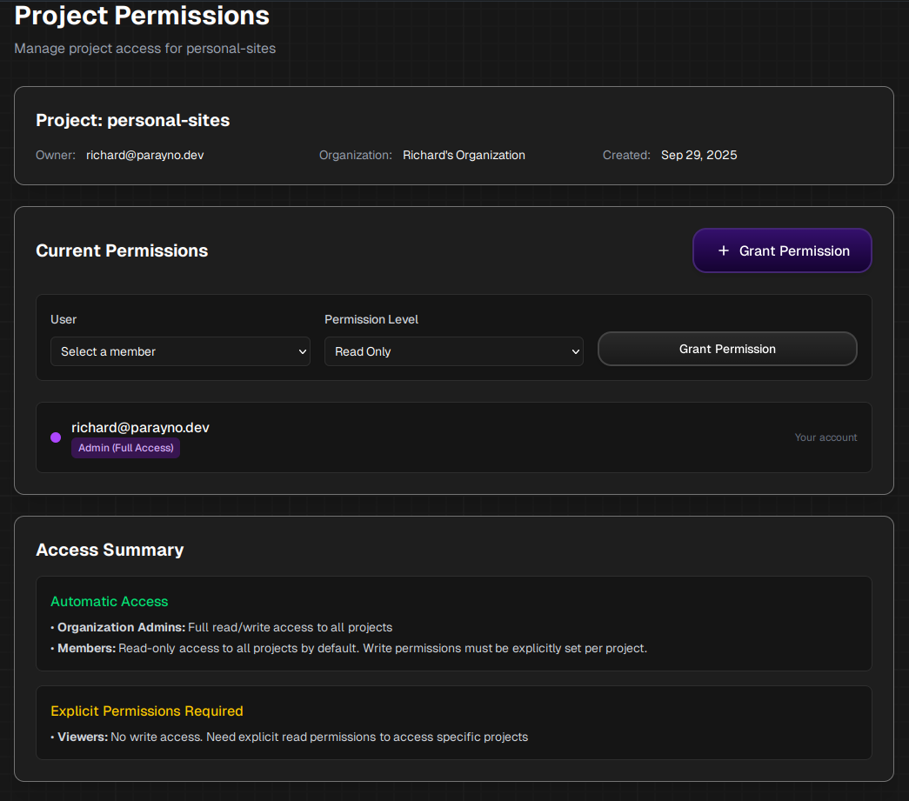

## What is Role-Based Access Control?

Role-Based Access Control (RBAC) in Navegante allows you to manage who can access your [Infrastructure Projects](../infrastructure-projects) and what actions they can perform. Navegante currently offers basic RBAC with two permission levels: **Read Only** and **Read & Write** (Full Access), applied at the Infrastructure Project level.

## Accessing Project Permissions

All Navegante accounts are assigned a default organization. To manage permissions for a project:

1. Navigate to the [Organizations](../organizations) page
2. Select the organization that contains your project
3. Click **"Manage Organization"** to view your organization's projects
4. Find the Infrastructure Project you want to manage
5. Click the **"Permissions"** button next to the project

## Project Permissions

The Project Permissions page displays project information and allows you to manage access for organization members.

### Project Information

The header displays key details about the project:

| Field | Description |
|-------|-------------|
| **Project** | The name of the Infrastructure Project (e.g., `personal-sites`). |
| **Owner** | The email of the project owner. |
| **Organization** | The organization that owns this project. |
| **Created** | The date the project was created. |

### Current Permissions

This section shows all users with access to the project and allows you to grant new permissions.

To grant a permission:

1. Select a member from the **"User"** dropdown
2. Choose a **"Permission Level"** (Read Only or Full Access)
3. Click **"Grant Permission"**

Existing permissions are listed below, showing each user's email and their access level badge (e.g., "Admin (Full Access)").

## Permission Levels

| Level | Description |
|-------|-------------|
| **Read Only** | Can view the project and its configurations but cannot make changes. |
| **Read & Write** | Can view and modify the project, including deployments and configurations. |

## Access Summary

Navegante applies the following default access rules:

### Automatic Access

- **Organization Admins**: Full read/write access to all projects in the organization.
- **Members**: Read-only access to all projects by default. Write permissions must be explicitly set per project.

### Explicit Permissions Required

- **Viewers**: No write access. Need explicit read permissions to access specific projects.

## Related Pages

- [Organizations](../organizations) - Manage your organization and team members
- [Infrastructure Projects](../infrastructure-projects) - Learn about projects and their settings
